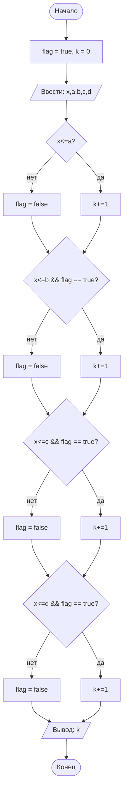

## Отчет по лабораторной работе № 1

#### № группы: `ПМ-2401`

#### Выполнил: `Безносова Варвара Владиславовна`

#### Вариант: `3`

### Cодержание:

- [Постановка задачи](#1-постановка-задачи)
- [Входные и выходные данные](#2-входные-и-выходные-данные)
- [Выбор структуры данных](#3-выбор-структуры-данных)
- [Алгоритм](#4-алгоритм)
- [Программа](#5-программа)
- [Анализ правильности решения](#6-анализ-правильности-решения)

### 1. Постановка задачи
>Шарик диаметром x пытаются протащить через последовательность отверстий диаметрами a,b,c,d. Через какое количество отверстий удастся протащить шарик? На вход программы подаются натуральные числа x,a,b,c,d.

Число `х` должно быть меньше каждого из чисел, чтобы можно было протащить шарик через все отверстия. Нужно по порядку, от `a` до `d`, сравнить `x` со всеми числами.
Нужно завести счетчик `k`, который показывает, через сколько отверстий прошел шарик.  Также заводим булевую переменную `flag`, которая показывает, прошел ли шарик через все отверстия до текущего. Далее в условиях if сравниваем `x` со всеми переменными. Если диаметр шарика меньше переменной и `flag` = true, то `k` увеличиваем на 1. Если нет, то `flag` = false, т.к. если шарик не прошел через какое-то отверстие, то он и не пройдет через все последующие .

### 2. Входные и выходные данные

#### Данные на вход

На вход программа должна получать 5 натуральных чисел.


#### Данные на выход

На выходе мы получим целое число `k`, 0<=`k`<=4, т.к. если `x`>`a`, то `k`=0, шарик не пройдет ни через одно отверстие, а если `k`=4, то значит, что шарик прошел через все отверстия

### 3. Выбор структуры данных

Программа получает 5 натуральных чисел. Поэтому для их хранения
можно выделить 5 переменных (`x` ,`a`,`b`,`c` и `d`) типа int.
Результат мы храним в переменной `k` типа int
### 4. Алгоритм

#### Алгоритм выполнения программы:

1. **Ввод данных:**  
   Программа считывает 4 натуральных числа, обозначенные как `x`, `a`,`b`, `c` и  `d`. Инициализируем переменные `k` и  `flag`: `k`=0, `flag`=true.

2. **Сравнение чисел:**  
   Программа по очереди сравнивает значение `x` с переменными `a`,`b`,`c`,`d`. Если `x`<=переменной и `flag`=true, то к счетчику `k`мы прибавляем 1, `flag` равен true. Если нет, то к счетчику `k` мы ничего не прибавляем, а `flag`=false.   

3. **Вывод результата:**
На выходе мы получаем значение переменной `k`, которое обозначает количество пройденных шариком отверстий.
  
   ### Блок-схема


### 5. Программа
```java
import java.util.Scanner;
public class Main{
    public static void main (String[] args){
        Scanner s = new Scanner(System.in);
        int x = s.nextInt();
        int a = s.nextInt();
        int b = s.nextInt();
        int c = s.nextInt();
        int d = s.nextInt();
        int k = 0;
        boolean flag = true;
        if (x<=a && flag==true){
            k=k+1;
        } else{ flag = false;};
        
        if (x<=b && flag==true){
            k=k+1;
        } else{ flag = false;};
        
        if (x<=c && flag==true){
            k=k+1;
        } else{ flag = false;};
        
        if (x<=d && flag==true){
            k=k+1;
        } else{ flag = false;};
        System.out.println(k);
    }
    
}
```
### 6. Анализ правильности решения

Программа работает корректно на всем множестве решений с учетом ограничений.

1. Тест на `x=a=b=c=d`:

    - **Input**:
        ```
        1 1 1 1 1
        ```

    - **Output**:
        ```
        4
        ```

2. Тест на `x>a<=b<=c<=d`:

    - **Input**:
        ```
        2 1 2 3 4
        ```

    - **Output**:
        ```
        0
        ```

3. Тест на `x<=a<=b<=c<=d`:

    - **Input**:
        ```
        1 2 3 4 5
        ```

    - **Output**:
        ```
        4
        ```

4. Тест на `x<=a>b<=c<=d` :

    - **Input**:
        ```
        5 6 3 7 8
        ```

    - **Output**:
        ```
        1
        ```

5. Тест на `x<=a<=b>c<=d` :

    - **Input**:
        ```
        2 3 4 1 8
        ```

    - **Output**:
        ```
        2
        ```
        
 6. Тест на `x<=a<=b<=c>d` :

    - **Input**:
        ```
        3 5 6 7 2
        ```

    - **Output**:
        ```
        3
        ```